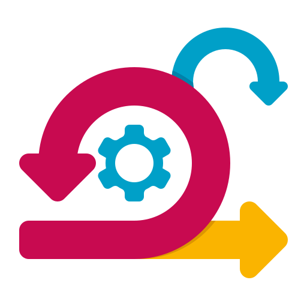
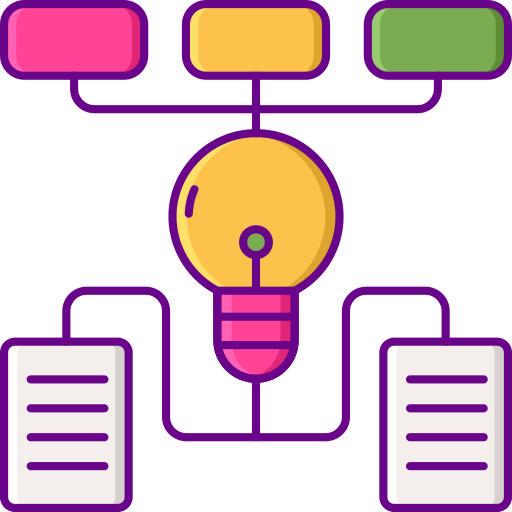

# Programming Foundations 

## Basics (Working with System)

### Minimum Physical Requirements 

Make sure you have/know following before starting to work with computer: 
* External keyboard and mouse 
* At least one extra monitor 
* Knowing the ergonomics of working with computer: [Basic of Ergonomics](https://blog.codinghorror.com/computer-workstation-ergonomics/) 
---

### Touch Typing 

You can find any online courses to improve your typing and gain the skill 

- One example is: [Typing.com](https://www.typing.com/student/lessons) 

---
### Basic Linux Commands Knowledge 

You must have a basic knowledge of linux commands.  Basic understanding of folder structure and basics of working with OS. 

* Basic Linux Commands: [25 Must know Linux Commands](https://hackr.io/blog/basic-linux-commands)
* Basic understanding of following concepts is highly recommended:
    * Linux File System 
    * Environment Variables and some of the important ones (PATH, SHELL, ...)
    * Working with package managers for your distribution

> If you are Windows user you have to install the [Windows Subsystem for Linux (WSL)](https://docs.microsoft.com/en-us/windows/wsl/install)  and be able to work with it in your local machine. 

---
### Basic Knowledge of working with IDE 

VSCode is the selected IDE in our company and we are using it for almost all languages.  Here are the basics that you should know (learn) before starting to work: 
* [Ability to install and work with VS code ](https://code.visualstudio.com/docs)
* [Ability to install and configure extensions](https://code.visualstudio.com/docs/editor/extension-marketplace) 
* [If using WSL to run VSCode Server from terminal ](https://code.visualstudio.com/docs/remote/wsl)

> Visit [VSCode Roadmap](./VSCode.exercise.md) exercise module to learn using VSCode in action. 

---

### Basic Knowledge of SCRUM and Tools

We are utilizing SCRUM as our main development methodology.  You must be familiar with concepts of SCRUM methodology. You should know: 
* Roles in Scrum: ***Scrum Master, Product Owner, Scrum Team***
* Concepts: ***Story Point, Definition of Done, Sprints***
* Practices in Scrum: ***Daily Standups, Planning, Planning Poker, Retrospective, Showcase***

See: [Atlassian Guide to Scrum](https://www.atlassian.com/agile/scrum) 

---
### Basic Knowledge of GIT 

Git is the fundamental tool to work in group of developers.  Everyone in the team must have a basic understanding of the GIT concepts Including ***Commit Hash, History, Branching, Merging, Rebase, Tag, HEAD, Staging, Reset, Remote, Pull, Fetch***

For this reason we strongly suggest to read first 3 chapters of [GIT Book](https://git-scm.com/book/en/v2). 

---

##  Data structurs and algorithms 

Every one working in filed of programming must have an understanding of data structures and algorithms. These are the building blocks of thinking as a developer. 

Before jumping into suggested resources you have to understand following concepts: 
* Data structures: ***Stacks, Queues, Tree and Binary Tree, Hashing and Hashmaps***
* Understanding of algorithm complexity :***O notation***
* Basic understanding of main algorithmic techniques: ***Greedy Algorithms, Divide and Conquer, Dynamic Programming, Sorting Algorithms(Quick Sort, Merge Sort, Bubble Sort,...)***

Our suggestion is to finish the first 3 weeks of [Introduction to Algorithms](https://www.coursera.org/learn/algorithms-part1). Please note that just 3 weeks is enough. 

---
## Clean Coding 

You must be familiar with principles of clean coding. For this we strongly suggest to read uncle Bob's [Clean Code Book](https://www.amazon.com/Clean-Code-Handbook-Software-Craftsmanship/dp/0132350882). 

We suggest to print the [summary of clean code](https://gist.github.com/wojteklu/73c6914cc446146b8b533c0988cf8d29) and have it next to your coding desk. 

Specially for Javascript  have a look at this to see [examples in Javascript](https://github.com/ryanmcdermott/clean-code-javascript)

> One golden rule of design principles is that whenever you duplicate (copy/paste) the code, there is  something wrong with your coding. 

---

### Attributions
<a href="https://www.flaticon.com/free-icons/algorithm" title="algorithm icons">Algorithm icons created by Flat Icons - Flaticon</a>

<a href="https://www.flaticon.com/free-icons/git" title="git icons">Git icons created by edt.im - Flaticon</a> 

<a href="https://www.flaticon.com/free-icons/scrum" title="scrum icons">Scrum icons created by Flat Icons - Flaticon</a>

<a href="https://www.flaticon.com/free-icons/microsoft" title="microsoft icons">Microsoft icons created by Freepik - Flaticon</a>

<a href="https://www.flaticon.com/free-icons/linux" title="linux icons">Linux icons created by Freepik - Flaticon</a>

<a href="https://www.flaticon.com/free-icons/code" title="code icons">Code icons created by Freepik - Flaticon</a>
